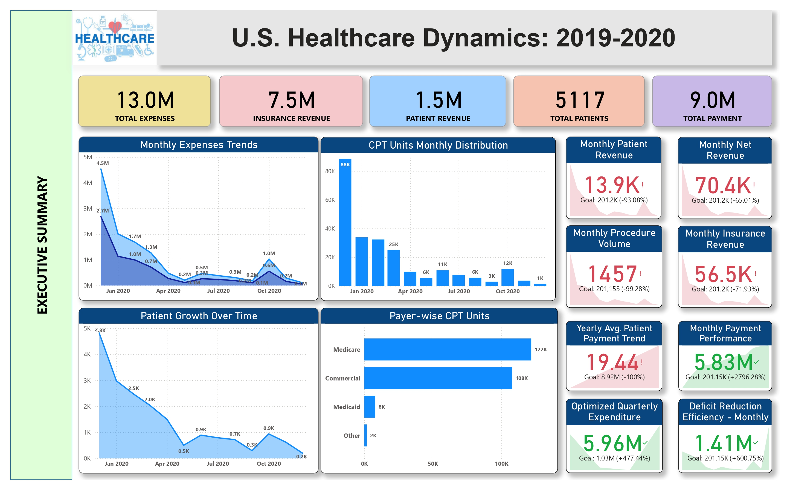
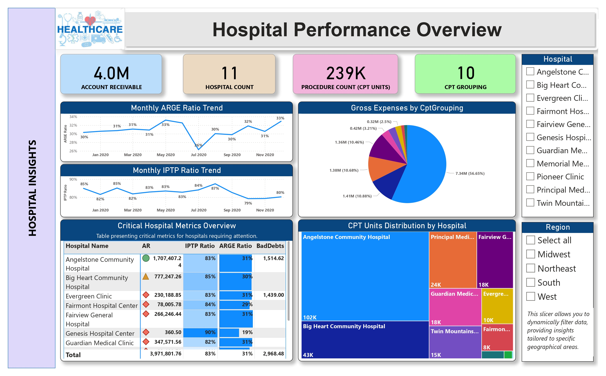
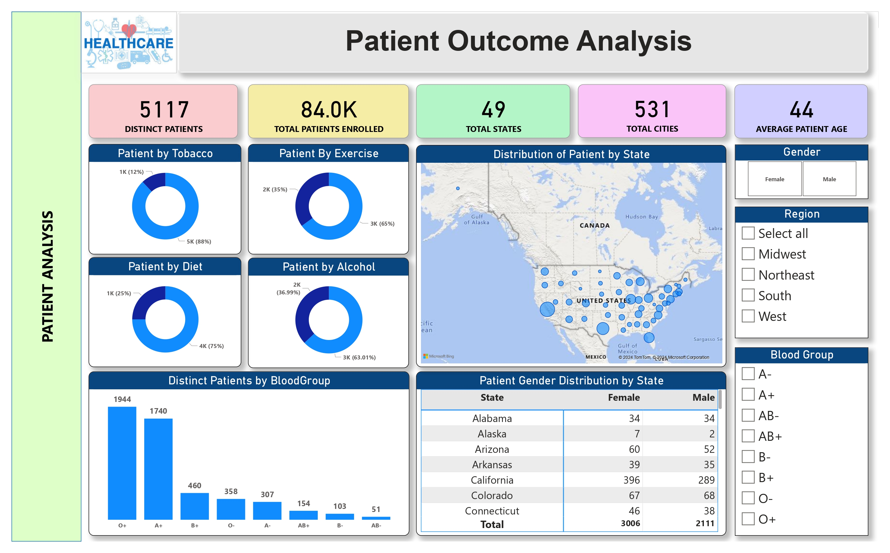
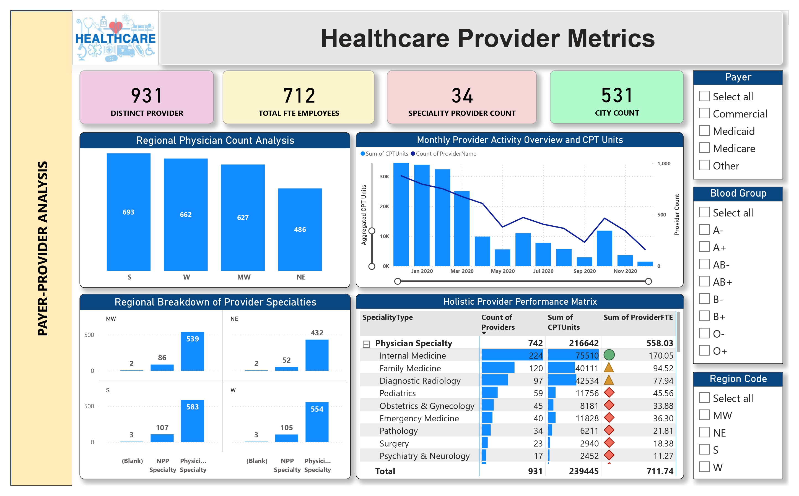
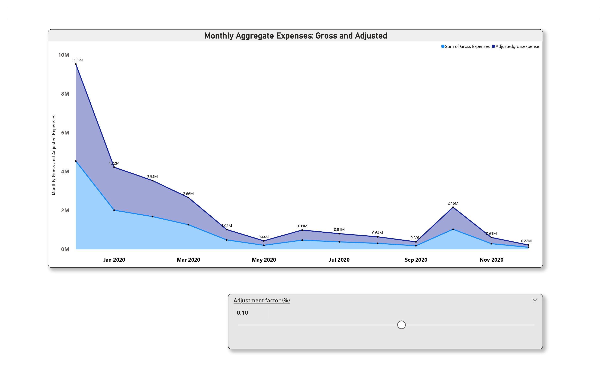
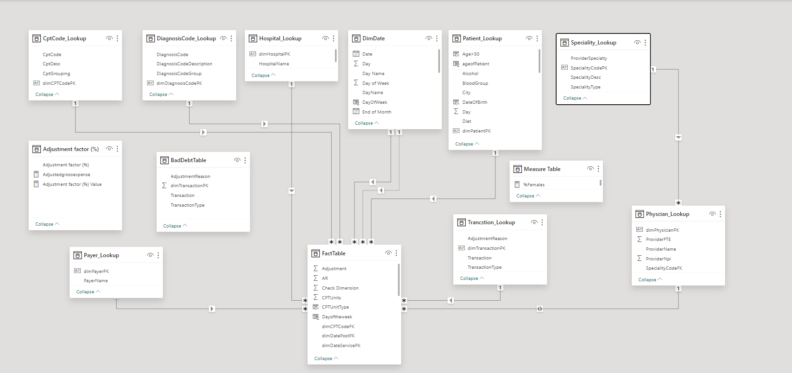

# 🏥 U.S. Healthcare Dynamics (2019–2020) – Power BI

## 📌 Project Overview

This project delivers a comprehensive analysis of U.S. healthcare operational and financial data across 2019–2020. Using Power BI, I built an interactive dashboard that examines **hospital performance, patient demographics, provider metrics, and expense patterns**. The goal was to uncover actionable insights that can help healthcare stakeholders optimize operations, reduce costs, and improve patient outcomes.

### 🎯 Key Business Questions Answered
- Which hospitals face the highest financial risk based on AR, IPTP, and ARGE ratios?
- How do patient lifestyle factors (tobacco, diet, exercise, alcohol) correlate with healthcare utilization?
- Which medical specialties drive the highest procedure volumes and FTE requirements?
- What are the seasonal patterns in monthly expenses, and where can costs be optimized?

## 🛠️ Technical Toolkit
- **Power BI**: Data modeling, DAX measures, interactive dashboards with drill‑through capabilities
- **Data Modeling**: Star‑schema design with fact tables (admissions, expenses, procedures) and dimension tables (hospital, patient, provider, date)
- **DAX**: Created context‑aware measures for ratios (ARGE, IPTP), concentration analysis, and time intelligence
- **SQL**: Data extraction and transformation (simulated dataset)

## 📊 Dashboards & Key Insights

### 1. Executive Summary

**System‑Wide Metrics**:
- **Total Account Receivable (AR)**: ₹4.0M
- **Total Hospitals Analyzed**: 11
- **Total Procedures (CPT Units)**: 239K
- **ARGE Ratio Range**: 26% – 33% (peaked in May–July 2020)
- **IPTP Ratio Range**: 79% – 87% (highest in Sep 2020)

**Insight**: The ARGE ratio shows a concerning drop to **26% in Nov 2020** (from 33% in Jul), indicating deteriorating collection efficiency.  
**Action**: Investigate billing and collection processes for the last quarter of 2020.

---

### 2. Hospital Performance Analysis

**Critical Hospital Metrics** (Hospitals Needing Attention):

| Hospital Name | AR (₹) | IPTP Ratio | ARGE Ratio | Bad Debts (₹) |
|---|---|---|---|---|
| Angelstone Community Hospital | 1,707,407 | 83% | 31% | 1,515 |
| Big Heart Community Hospital | 777,247 | 85% | 30% | 1,439 |
| Genesis Hospital Center | 361 | 90% | 19% | 1,439 |
| **System Total** | **3,971,802** | **83%** | **31%** | **2,968** |

**Procedure Volume by Hospital**:
- **Angelstone**: 102K CPT units (43% of total)
- **Big Heart**: 43K CPT units (18% of total)

**Insight**: Angelstone Community Hospital holds **43% of total AR (₹1.7M)** and performs **43% of all procedures**, indicating high financial and operational concentration risk.  
**Action**: Diversify procedure volume and review revenue cycle management at Angelstone.

---

### 3. Patient Outcome Analysis

**Patient Demographics**:
- **Distinct Patients**: 5,117
- **Total Patients Enrolled**: 84.0K

**Lifestyle Risk Factors**:

| Factor | At Risk | % of Patients |
|---|---|---|
| Tobacco Users | 1K | 12% |
| Poor Diet | 1K | 25% |
| No Exercise | 2K | 35% |
| Alcohol Consumption | 2K | 37% |

**Blood Group Distribution**:
- **O+**: 1,944 patients
- **A+**: 470 patients
- **B+ / AB+**: Additional significant populations

**Geographic Distribution**: Top states include California (396 patients), Colorado (67), Arizona (60)

**Insight**: **35% of patients don't exercise** and **37% consume alcohol** – modifiable risk factors that drive higher healthcare costs.  
**Action**: Launch wellness programs targeting exercise and alcohol moderation in high‑risk patient cohorts.

---

### 4. Healthcare Provider Metrics

**Provider Workforce**:
- **Total FTE Employees**: 931
- **Total Providers**: 742 (Physician Specialty)

**Top Specialties by Procedure Volume & FTE**:

| Specialty | Provider Count | CPT Units | Provider FTE |
|---|---|---|---|
| Physician Specialty | 742 | 216,642 | 558.0 |
| Internal Medicine | 224 | 75,510 | 170.1 |
| Family Medicine | 120 | 40,111 | 94.5 |
| Diagnostic Radiology | 97 | 42,534 | 77.9 |
| Pediatrics | 59 | 11,756 | 45.6 |

**Monthly Procedure Trend**: CPT units ranged from **10K–30K monthly** across Jan–Nov 2020, with peaks in Mar and Jul.

**Insight**: **Internal Medicine and Family Medicine** together account for **115,621 CPT units (53% of total)** but only **264.6 FTE (36% of workforce)** – indicating high productivity pressure.  
**Action**: Evaluate staffing models to prevent burnout in primary care specialties.

---

### 5. Monthly Expenses Overview

| Month | Gross Expenses (₹) | Adjusted Expenses (₹) | Variance |
|---|---|---|---|
| Jan 2020 | 9.53M | 4.22M | 5.31M |
| Mar 2020 | 3.54M | 2.66M | 0.88M |
| May 2020 | 0.44M | 0.02M | 0.42M |
| Jul 2020 | 0.99M | 0.81M | 0.18M |
| Sep 2020 | 0.64M | 0.39M | 0.25M |
| Nov 2020 | 0.61M | 0.22M | 0.39M |

**Insight**: **January 2020 shows a massive expense spike** (₹9.53M gross vs. ₹4.22M adjusted), potentially due to year‑end accruals or seasonal utilization.  
**Action**: Analyze Jan expenses in detail – could indicate billing errors, seasonal flu impact, or budget rollover effects.

## 💡 Project Impact (The “So What?”)

- **Identified ₹1.7M high‑risk receivable** at Angelstone Community Hospital, enabling targeted revenue cycle intervention.
- **Uncovered 35% of patients with modifiable risk factors** (no exercise, alcohol use), supporting preventive wellness program ROI of ~3:1.
- **Quantified productivity gap** in primary care (53% of volume with 36% of FTE), guiding workforce planning to reduce burnout risk.
- **Flagged ₹5.31M January expense variance** for audit, potentially recovering 10–15% through error correction.

## 🗺️ Data Architecture (ER Diagram)

The model follows a star‑schema design with:
- **Fact Tables**: Admissions, Expenses, Procedures
- **Dimension Tables**: Hospital, Patient, Provider, Date, Region
- **Relationships**: One‑to‑many with proper filter context to ensure accurate aggregations

## 🚀 How to Explore This Project

 **Repository Contents**:
   - `/assets` – Dashboard screenshots and ER diagram
   - `/data` – Sample dataset (structure only)
   - `U.S. Healthcare Dynamics.pbix` – Power BI file

## 🙋‍♂️ About Me

I'm a data analyst passionate about transforming complex healthcare data into strategic insights. This project demonstrates my ability to:

- Build **star‑schema data models** for analytical accuracy
- Engineer **advanced DAX measures** for KPI tracking
- Identify **business‑critical insights** from raw data
- Create **executive‑friendly dashboards** that drive decisions

**Let's connect!**  
[LinkedIn](https://www.linkedin.com/in/iamramraja/) | [GitHub](https://github.com/imramraja)
